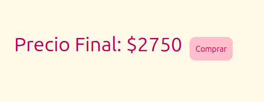

# Trabajo Practico Final de Introducción al Desarrollo de Software 1C-2025

# KpopCardz

KpopCardz es una página web de registro de ventas y coleccion de photocards. Permite agregar photocards y albums desde un apartado en modo administrador y permite comprar photocards y albums con photocards los cuales se registran. Los registros de ventas se guardan en el apartado de administrador con el nombre del usuario con el que se registro.


Se puede encontrar la estructura de la base de datos en el archivo

```
./backend/src/scripts/db.sql
```

Para levantar la base de datos y ver la Página correr:

```
make start-page
```

Para levantar solo el backend 
```
run-backend
```

Si esta en macOS y el primer comando no funciona, pruebe para levantar la base de datos y ver la Página:

```
make  start-page-alt
```

Si desea ver los logs del frontend:

```
make logs-frontend
```

Si solo se quiere levantar la base de datos:

```
make start-db
```

Si quiere cerrar la base de datos:

```
make stop-db
```

# Funcionamiento de la página
## Pagina del administrador
Se pueden crear photocards con un formulario el cual se verifica antes de crearlo

Tambien se pueden crear photocards con un formulario el cual se verifica antes de crearlo

Se puede ver el registro de ventas


## Pagina del usuario
Se pueden agregar photocards al carrito y verlas

Tambien se pueden agregar albums al carrito pero solo se agregan las photocards que contiene. El precio que contiene es el total con las photocards que contiene

Al seleccionar el carrito aparecen todas las photocards y el precio total a pagar

Al seguir con la compra se pide los datos de compra. Al finalizar la compra esta se registra en la página del administrador


# Consideraciones Importantes al Usar la Página

## Pautas para Completar Formularios

- En los campos solo se pueden poner letras o numeros.
- Un carácter no puede aparecer más de dos veces consecutivas.
- Para cargar las imagenes, se deben colocar en /frontend/Pagina-de-Administrador/k-card-inicio/images , en la carpeta que corresponda
- En el campo de la imagen se debe poner el nombre del archivo junto al formato . webp, si es correcto el nombre en la card se verá la imagen.

## Advertencia

Los contenedores de docker se ejecutan en los puertos : 3000, 5432 y 8080.

# Grupo

Los emuladores

# Integrantes

Ian Albornoz y Mayra Belen Ajnota Alarcon
